# Mapping-Forward

Synthèses are published on https://mappingforward.substack.com

Technical watch for mapping and geographical intelligence

## Statistics

Articles per month:

2026-04 | █████ 14 
2026-03 | ████████████████████████████████████████████████████████████████████ 202 
2026-02 | █████████████████████ 62 
2026-12 | █ 1

## Articles

### 2026

#### April (19 articles)
- [Get Started with the Google Maps Geocoding API v3](src/2026-04/20260331-google-maps-geocoding-api-v3.md)
- [Nordregio Maps: Nordic and Arctic Regional Development Cartography](src/2026-04/20260403-nordregio-maps-nordic-regional-development.md)
- [These Maps Show Exactly Where the West Might Burn This Summer](src/2026-04/20260402-grist-wildfire-risk-maps-western-us.md)
- [New Advisory Floodplain Maps Available for Five Eastern North Carolina River Basins](src/2026-04/20260401-nc-floodplain-maps-eastern-nc-river-basins.md)
- [Microsoft Bing Maps si aggiorna con i dati TomTom Orbis Maps](src/2026-04/20260403-microsoft-bing-maps-tomtom-orbis-it.md)
- [National Geospatial Policy Strengthening India's Mapping Ecosystem](src/2026-04/20260403-india-national-geospatial-policy.md)
- [TomTom selected by LOCUS to provide high-precision traffic data for location intelligence platform](src/2026-04/20260403-tomtom-selected-by-locus-traffic-data.md)
- [Location data for a greener future](src/2026-04/20260401-tomtom-location-intelligence-greener-future.md)
- [Microsoft integra dados da TomTom Orbis no Bing Maps e Copilot para melhorar localizações](src/2026-04/20260403-microsoft-tomtom-orbis-bing-maps-pt.md)
- [Bing Maps draait nu volledig op TomTom Orbis-adresdata](src/2026-04/20260403-bing-maps-tomtom-orbis-nl.md)
- [Microsoft's Bing Maps Receives Its Largest Address Data Upgrade in Years via TomTom Orbis](src/2026-04/20260403-bing-maps-tomtom-orbis-address-upgrade.md)
- [Digital Indoor Map Market Is Going to Boom | Google, Apple, HERE Technologies, Mapbox](src/2026-04/20260403-digital-indoor-map-market-boom.md)
- [3D Wayfinding Software Market Is Going to Boom | Mapbox, Pointr, Navigine, IndoorAtlas](src/2026-04/20260403-3d-wayfinding-software-market-boom.md)
- [The AI-Ready Spatial Stack: How Wherobots and Felt Are Redefining GIS](src/2026-04/20260401-the-ai-ready-spatial-stack-felt-wherobots.md)
- [Bing Maps Receives Its Largest Address Data Upgrade in Years](src/2026-04/20260402-bing-maps-largest-address-data-upgrade-tomtom-orbis.md)
- [Bing Maps draait nu volledig op TomTom Orbis-adresdata (ICT Magazine)](src/2026-04/20260402-bing-maps-tomtom-orbis-adresdata-ictmagazine.md)
- [必应地图迎来最大规模地址数据升级 引入 TomTom Orbis全球数据集](src/2026-04/20260402-bing-maps-tomtom-orbis-upgrade-cnbeta.md)
- [Microsoft zakończył aktualizację map. Ogromna baza danych](src/2026-04/20260402-microsoft-bing-maps-tomtom-aktualizacja-wppl.md)
- [Bing Maps recibe su mayor actualización de datos en años](src/2026-04/20260402-bing-maps-actualizacion-datos-computerhoy.md)

#### March (202 articles)
- [Tout savoir sur Roole Map, le nouveau GPS français qui veut détrôner Waze et Google Maps](src/2026-03/20260331-roole-map-french-gps-app.md)
- [How GIS Technology Supports Smarter Urban Development](src/2026-03/20260331-how-gis-technology-supports-smarter-urban-development.md)
- [Cette nouveauté dans Google Maps va changer la vie de nombreux automobilistes](src/2026-03/20260331-google-maps-ev-route-planning-android-auto-fr.md)
- [Google Maps annonce une nouvelle fonctionnalité pour faciliter les trajets en voiture électrique](src/2026-03/20260331-google-maps-ev-presse-citron.md)
- [Google Maps gère enfin la recharge des voitures électriques, mais...](src/2026-03/20260331-google-maps-ev-mac4ever.md)
- [Google Maps : conducteurs de voitures électriques, ce stress du calcul mental à chaque trajet, c'est fini](src/2026-03/20260331-google-maps-ev-lesnumeriques.md)
- [L'IA de Google Maps va totalement changer les longs trajets en voitures électriques pour plus de 350 modèles](src/2026-03/20260331-google-maps-ev-frandroid.md)
- [Avec cette nouveauté Android Auto, Google veut simplifier vos trajets en voiture électrique](src/2026-03/20260331-google-maps-ev-automobile-propre.md)
- [Vous roulez en électrique ? Cette nouveauté de Google Maps devrait vous plaire](src/2026-03/20260331-google-maps-ev-01net.md)
- [Google Maps Adds AI EV Features For Smarter Travel: Here's How It Works](src/2026-03/20260331-google-maps-ev-outlookbusiness.md)
- [Google Maps adds AI-based EV route planning to Android Auto](src/2026-03/20260330-google-maps-ev-route-planning-electrive.md)
- [Why GIS Matters in Modern Infrastructure and Urban Planning: Building Smarter, Future-Ready Cities](src/2026-03/20260330-why-gis-matters-modern-infrastructure-urban-planning.md)
- [Google Maps Can Now Plan EV Road Trips With Charging Stops via Android Auto](src/2026-03/20260330-google-maps-ev-trip-planning-cnet.md)
- [Google Gets Feature Every EV Owner Has Dreamed Of](src/2026-03/20260330-google-maps-ev-droid-life.md)
- [Google Maps Is Bringing EV Route Planning To Android Auto](src/2026-03/20260330-google-maps-ev-insideevs.md)
- [Google Maps simplifies battery predictions and trip planning for 350+ Android Auto EV models](src/2026-03/20260330-google-maps-ev-battery-predictions-blog-google.md)
- [Google Maps now predicts battery life for 350+ EVs](src/2026-03/20260330-google-maps-ev-android-police.md)
- [Android Auto brings Google Maps EV trip planning to 350+ models from 16 brands](src/2026-03/20260330-android-auto-maps-ev-9to5google.md)
- [Spectral Map Making With SPHEREx](src/2026-03/20260330-spherex-spectral-map-making.md)
- [Google Maps : ce nouveau système de guidage ultra-pratique va changer vos trajets en voiture](src/2026-03/20260329-google-maps-ev-tf1info.md)
- [Google Maps' AI Feature 'Ask Maps' Comes To India: How Travellers Can Use It](src/2026-03/20260329-google-maps-ask-maps-india-ndtv.md)
- [Geologic Map of the Emmons Lake Volcanic Center, Alaska](src/2026-03/20260401-usgs-geologic-map-emmons-lake-volcanic-alaska.md)
- [New rules for mobile phone coverage maps in Australia](src/2026-03/20260326-australia-mobile-coverage-maps-acma.md)
- [Hanford Contractor Recognized for Advancing Cleanup With Innovative GIS Tools](src/2026-03/20260326-hanford-gis-cleanup-innovation-award.md)
- [GIS department holds annual Geo Day](src/2026-03/20260312-gis-department-holds-annual-geo-day.md)
- [HydroGNSS generates first Delay Doppler Maps](src/2026-03/20260329-hydrognss-generates-first-delay-doppler-maps.md)
- [La fin de la fonctionnalité préférée d'Apple Maps : des changements indésirables sont à venir](src/2026-03/20260329-la-fin-de-la-fonctionnalite-preferee-d-apple-maps-des-changements-indesirables-sont-a-venir.md)
- [Donner du sens aux observations océaniques](src/2026-03/20260327-donner-du-sens-aux-observations-oceaniques.md)
- [Cruisebound propose « Search by Map », la recherche de croisière par carte](src/2026-03/20260327-cruisebound-propose-search-by-map-la-recherche-de-croisiere-par-carte.md)
- [USGS National Cooperative Geologic Mapping Program Announces 2026 EDMAP Funding Opportunity](src/2026-03/20260327-usgs-national-cooperative-geologic-mapping-program-announces-2026-edmap-funding-opportunity.md)
- [New UN-backed atlas maps migratory lifelines of highly vulnerable bird species across the Americas](src/2026-03/20260326-new-un-backed-atlas-maps-migratory-lifelines-of-highly-vulnerable-bird-species-across-the-americas.md)
- [Mieux que Google Maps : cette appli GPS gratuite vous guide partout sans connexion Internet](src/2026-03/20260328-mieux-que-google-maps-cette-appli-gps-gratuite-vous-guide-partout-sans-connexion-internet.md)
- [Geographic Information Systems Market Set to Surge: A $44 Billion Opportunity by 2034](src/2026-03/20260327-geographic-information-systems-market-set-to-surge-a-44-billion-opportunity-by-2034.md)
- [Latest release delivers Britain's most detailed digital map](src/2026-03/20260327-latest-release-delivers-britains-most-detailed-digital-map.md)
- [Contextual Location Data, Unified Foundational Maps Paramount for Industry](src/2026-03/20260327-contextual-location-data-unified-foundational-maps-paramount-for-industry.md)
- [TomTom GO Navigation: La app de navegación que redefine la movilidad en 2026 con mapas inteligentes](src/2026-03/20260326-tomtom-go-navigation-la-app-de-navegacion-que-redefine-la-movilidad-en-2026-con-mapas-inteligentes.md)
- [Google Maps gets Gemini AI upgrade with 'Ask Maps' conversational feature](src/2026-03/20260326-google-maps-gets-gemini-ai-upgrade-with-ask-maps-conversational-feature.md)
- [Google Maps Down for Thousands, Downdetector Reports](src/2026-03/20260326-google-maps-down-for-thousands-downdetector-reports.md)
- [Google Maps : les applis GPS se réinventent avec l'IA](src/2026-03/20260326-google-maps-les-applis-gps-se-reinventent-avec-l-ia.md)
- [Waze, Google Maps: comment l'IA va révolutionner vos trajets (et votre façon de conduire)](src/2026-03/20260326-waze-google-maps-comment-l-ia-va-revolutionner-vos-trajets-et-votre-facon-de-conduire.md)
- [A $275 billion project maps every building on Earth for the first time — and the results are astonishing](src/2026-03/20260326-a-275-billion-project-maps-every-building-on-earth-for-the-first-time-and-the-results-are-astonishing.md)
- [Map-Making Is in the Hands of Big Tech. So Is Your Citizenship.](src/2026-03/20260326-map-making-is-in-the-hands-of-big-tech-so-is-your-citizenship.md)
- [Apple Confirms It's Bringing Ads to Maps as Part of New Apple Business Platform](src/2026-03/20260326-apple-confirms-its-bringing-ads-to-maps-as-part-of-new-apple-business-platform.md)
- [Türkiye maps social risks for preemptive action](src/2026-03/20260325-turkiye-maps-social-risks-for-preemptive-action.md)
- [UnTrNet: a transformer-based hyperspectral change detection using abundance maps](src/2026-03/20260325-untrnet-hyperspectral-change-detection-abundance-maps.md)
- [HD Maps Market Size, Share & Growth Analysis](src/2026-03/20260325-hd-maps-market-size-growth-outlook.md)
- [Mapping snow- and ice-free zones to monitor thermal activity in Yellowstone using high-resolution commercial satellite imagery](src/2026-03/20260325-mapping-snow-and-ice-free-zones-yellowstone-thermal.md)
- [La pub arrive sur Apple Maps cet été, mais pas encore en France](src/2026-03/20260325-la-pub-arrive-sur-apple-maps-cet-ete.md)
- [Au Vietnam, Google Maps met à jour les limites administratives jusqu'au niveau de la commune et du quartier.](src/2026-03/20260325-google-maps-cap-nhat-dia-gioi-hanh-chinh-moi-den-cap-xa-phuong.md)
- [Google Maps adds 3D immersive navigation and AI chat](src/2026-03/20260325-google-maps-adds-3d-immersive-navigation-and-ai-chat.md)
- [China Maps Ocean Floor Amid Concerns Over Submarine Warfare With US](src/2026-03/20260325-china-maps-ocean-floor-submarine-warfare.md)
- [Tech for Earth: Maps Are Getting Smarter](src/2026-03/20260325-tech-for-earth-maps-are-getting-smarter.md)
- [National Geographic featured new maps on Inuit homelands in Canada](src/2026-03/20260325-national-geographic-featured-new-maps-on-inuit-homelands.md)
- [Geographic Information System Software Market Growth & Outlook 2033](src/2026-03/20260325-gis-software-market-growth-outlook-2033.md)
- [Mapping Google's Unmappable City](src/2026-03/20260325-mapping-googles-unmappable-city.md)
- [Sharper Soil Moisture Maps From Space](src/2026-03/20260325-sharper-soil-moisture-maps-from-space.md)
- [Applying geospatial AI to solve global problems](src/2026-03/20260325-applying-geospatial-ai-to-solve-global-problems.md)
- [Vexcel’s worldwide aerial imagery plans for 2026](src/2026-03/20260325-vexcels-worldwide-aerial-imagery-plans-for-2026.md)
- [Google améliore l’expérience utilisateur Maps pour les cyclistes avec de nouvelles fonctionnalités](src/2026-03/20260325-google-ameliore-maps-pour-les-cyclistes.md)
- [Apple Maps : Visited Places devient incontournable sur iOS 26](src/2026-03/20260325-apple-maps-visited-places-ios-26.md)
- [Mapbox Selected by DennoKotsu to Modernize Taxi Dispatch Platform](src/2026-03/20260325-mapbox-selected-by-dennokotsu-to-modernize-taxi-dispatch.md)
- [Mapbox selected for DennoKotsu taxi dispatch platform](src/2026-03/20260325-mapbox-selected-for-dennokotsu-taxi-dispatch-platform.md)
- [Kapsch TrafficCom Aktie: TomTom-Partnerschaft](src/2026-03/20260325-kapsch-trafficcom-tomtom-partnership-ecotrafix.md)
- [Google Maps : ce nouveau bouton qui va rassurer vos proches (et vous simplifier la vie)](src/2026-03/20260325-google-maps-ce-nouveau-bouton-qui-va-rassurer-vos-proches.md)
- [Google Maps corrige son gros défaut avec ce bouton que tout le monde attendait](src/2026-03/20260325-google-maps-corrige-son-gros-defaut-avec-ce-bouton.md)
- [Google Maps : du nouveau pour le partage de position](src/2026-03/20260325-google-maps-du-nouveau-pour-le-partage-de-position.md)
- [This is the dawn of the AI-defined vehicle](src/2026-03/20260325-dawn-of-the-ai-defined-vehicle-tomtom.md)
- [Unraveling Sundarbans’ erosion: how machine learning maps climate change impacts](src/2026-03/20260325-unraveling-sundarbans-erosion-machine-learning-maps.md)
- [Google Maps lance la navigation immersive : voici ce qui change concrètement pour vos trajets en voiture](src/2026-03/20260325-google-maps-lance-la-navigation-immersive-voici-ce-qui-change-concretement.md)
- [Google Maps change de dimension : la plus grande mise à jour depuis 10 ans débarque](src/2026-03/20260325-google-maps-change-de-dimension-la-plus-grande-mise-a-jour-depuis-10-ans.md)
- [Google Maps : la navigation à vélo sera bientôt plus personnalisée](src/2026-03/20260325-google-maps-navigation-velo-plus-personnalisee.md)
- [Google Maps als Blitzerwarner: Trick funktioniert nicht mehr – das sind Alternativen](src/2026-03/20260325-google-maps-blitzerwarner-trick-funktioniert-nicht-mehr.md)
- [Google Maps change tout : découvrez la plus grande mise à jour de la navigation depuis 10 ans](src/2026-03/20260325-google-maps-change-tout-plus-grande-mise-a-jour-navigation.md)
- [Google Maps receives major upgrade with 'Ask Maps' AI feature and 3D redesign](src/2026-03/20260325-google-maps-receives-major-upgrade-ask-maps-immersive-navigation.md)
- [Google Maps brings a 3D map to your driving directions](src/2026-03/20260325-google-maps-brings-a-3d-map-to-your-driving-directions.md)
- [Google Maps Just Got a Massive Makeover for Drivers](src/2026-03/20260325-google-maps-just-got-a-massive-makeover-for-drivers.md)
- [Google Maps : la plus grosse mise à jour depuis 10 ans est là](src/2026-03/20260325-google-maps-la-plus-grosse-mise-a-jour-depuis-10-ans-est-la.md)
- [Google Maps reçoit sa mise à jour la plus importante depuis 10 ans](src/2026-03/20260325-google-maps-recoit-sa-mise-a-jour-la-plus-importante-depuis-10-ans-autoplus.md)
- [La plus grosse mise à jour en dix ans : Google Maps passe à l'ère de l'IA conversationnelle](src/2026-03/20260325-la-plus-grosse-mise-a-jour-en-dix-ans-google-maps-passe-a-lia-conversationnelle.md)
- [Google Maps bascule dans l’IA : sa plus grosse mise à jour en 10 ans](src/2026-03/20260325-google-maps-bascule-dans-lia-sa-plus-grosse-mise-a-jour-en-10-ans.md)
- [Google Maps Introduces "Ask Maps" and Immersive Navigation Powered by Gemini](src/2026-03/20260325-google-maps-introduces-ask-maps-and-immersive-navigation-powered-by-gemini.md)
- [Google Maps Gets Major AI Upgrade with Ask Maps and 3D Navigation Features](src/2026-03/20260325-google-maps-gets-major-ai-upgrade-with-ask-maps-and-3d-navigation-features.md)
- [Google: Gemini-Powered Ask Maps And Immersive Navigation Introduced For Mapping And Driving](src/2026-03/20260325-google-gemini-powered-ask-maps-and-immersive-navigation-introduced.md)
- [Google Maps introduces AI-Driven ‘Ask Maps’ and new 3D navigation experience](src/2026-03/20260325-google-maps-introduces-ai-driven-ask-maps-and-new-3d-navigation-experience.md)
- [Google procède actuellement à la plus grande mise à jour jamais réalisée pour Google Maps.](src/2026-03/20260325-google-procede-a-la-plus-grande-mise-a-jour-jamais-realisee-pour-google-maps.md)
- [Google Maps est sur le point de révolutionner notre façon de conduire.](src/2026-03/20260325-google-maps-est-sur-le-point-de-revolutionner-notre-facon-de-conduire.md)
- [Google Maps Gets Big Update](src/2026-03/20260325-google-maps-gets-big-update.md)
- [Google Maps : partager votre emplacement va devenir encore plus simple](src/2026-03/20260325-google-maps-partager-votre-emplacement-va-devenir-encore-plus-simple.md)
- [Google Maps va bientôt considérablement faciliter le partage de localisation grâce à ce changement subtil](src/2026-03/20260325-google-maps-va-bientot-considerablement-faciliter-le-partage-de-localisation-grace-a-ce-changement-subtil.md)
- [This Google Maps update could change how you share your location](src/2026-03/20260325-this-google-maps-update-could-change-how-you-share-your-location.md)
- [Google Maps : ce nouveau bouton va vous faire gagner du temps](src/2026-03/20260325-google-maps-ce-nouveau-bouton-va-vous-faire-gagner-du-temps.md)
- [Google Maps a commencé à mettre à jour ses cartes administratives au Vietnam.](src/2026-03/20260319-google-maps-a-commence-a-mettre-a-jour-ses-cartes-administratives-au-vietnam.md)
- [TomTom GO Navigation App Launches Major 2026 Update with AI-Driven Routing](src/2026-03/20260319-tomtom-go-navigation-app-launches-major-2026-update.md)
- [How Google Maps is shaping where we eat – video](src/2026-03/20260319-how-google-maps-is-shaping-where-we-eat.md)
- [Esri Releases Ninth Edition of Map Use: Map Reading and Design, the Definitive Guide to Cartographic Design](src/2026-03/20260319-esri-releases-ninth-edition-of-map-use.md)
- [EUDR - Report on the Use of National and Global Forest Cover Maps to Assess Deforestation Risks in the Context of EUDR - Case Study from Vietnam](src/2026-03/20260319-eudr-forest-cover-maps-vietnam.md)
- [TomTom CEO shake-up as mapping pioneers depart](src/2026-03/20260319-tomtom-ceo-shake-up-automotiveworld.md)
- [Google Maps s’apprête à évoluer](src/2026-03/20260319-google-maps-sapprete-a-evoluer-motor1.md)
- [Google Maps reçoit sa « plus importante mise à jour depuis plus de dix ans »](src/2026-03/20260319-google-maps-plus-importante-mise-a-jour-zdnet.md)
- [La plus grande mise à jour depuis 10 ans : le nouveau Google Maps veut vous en mettre plein la vue](src/2026-03/20260319-google-maps-plus-grande-mise-a-jour-10-ans-01net.md)
- [National Water Dashboard Map of South Atlantic Drought Conditions](src/2026-03/20260324-national-water-dashboard-map-south-atlantic-drought.md)
- [NASA made a jaw-dropping map of Earth's seafloor from space, using an ingenious technique](src/2026-03/20260324-nasa-made-map-of-earths-seafloor-from-space.md)
- [Around the Geospatial, 3D, and AEC Industries: Delta’s, NSRS Modernization, and Relative Error Ellipses](src/2026-03/20260323-around-the-geospatial-3d-and-aec-industries.md)
- [Apple Maps may be about to get ads](src/2026-03/20260323-apple-maps-may-be-about-to-get-ads.md)
- [Apple Maps will introduce ads this summer](src/2026-03/20260323-apple-maps-will-introduce-ads-this-summer.md)
- [TomTom GO Navigation: Die smarte Navigations-App mit Live-Verkehr und Offline-Karten revolutioniert](src/2026-03/20260323-tomtom-go-navigation-die-smarte-navigations-app.md)
- [Google Maps का मास्टरस्ट्रोक! अब नजर आएंगे ये बदलाव](src/2026-03/20260322-google-maps-new-update-smart-navigation-features-aajtak.md)
- [Google rolls out its biggest Maps overhaul in a decade: 8 big changes to know](src/2026-03/20260321-google-rolls-out-biggest-maps-overhaul-moneycontrol.md)
- [TomTom GO Navigation: La app de navegación que revoluciona los viajes en coche en Europa con mapas](src/2026-03/20260320-tomtom-go-navigation-revoluciona-viajes-en-coche.md)
- [Google Maps a commencé à mettre à jour ses cartes administratives du Vietnam.](src/2026-03/20260320-google-maps-a-commence-a-mettre-a-jour-ses-cartes-administratives-du-vietnam.md)
- [Mapping the unmapped Google Maps city](src/2026-03/20260320-mapping-the-unmapped-google-maps-city.md)
- [GIS and BIM, A Marriage Made in Profit.](src/2026-03/20260318-gis-and-bim-a-marriage-made-in-profit.md)
- [RELEASE: New Global Platform Maps Urban Heat Risks Block by Block—and Shows Cities How to Cool Them](src/2026-03/20260318-cool-cities-lab-maps-urban-heat-risks.md)
- [Google Maps cập nhật địa giới hành chính mới tại Việt Nam năm 2026](src/2026-03/20260318-google-maps-cap-nhat-dia-gioi-hanh-chinh-moi-tai-viet-nam.md)
- ['Hit the road more confidently': Google rolls out 3D immersive navigation feature to Maps](src/2026-03/20260318-google-rolls-out-3d-immersive-navigation-feature-to-maps.md)
- [Google Maps commence à actualiser la carte administrative du Vietnam](src/2026-03/20260318-google-maps-commence-a-actualiser-la-carte-administrative-du-vietnam.md)
- [Google Maps met à jour sa carte des limites administratives au Vietnam.](src/2026-03/20260318-google-maps-met-a-jour-sa-carte-des-limites-administratives-au-vietnam.md)
- [Google Maps met à jour les frontières administratives du Vietnam huit mois après la fusion.](src/2026-03/20260318-google-maps-met-a-jour-les-frontieres-administratives-du-vietnam-huit-mois-apres-la-fusion.md)
- [Google Maps intègre les meilleures fonctions de Waze : ce qui change pour vous en 2026](src/2026-03/20260317-google-maps-integre-les-meilleures-fonctions-de-waze.md)
- [Google Maps : dopée à l'IA, cette nouvelle fonctionnalité pleine de promesses](src/2026-03/20260317-google-maps-dopee-a-lia-cette-nouvelle-fonctionnalite-pleine-de-promesses.md)
- [National groundwater nitrogen inventory and heat maps for England](src/2026-03/20260317-national-groundwater-nitrogen-inventory-heat-maps-england.md)
- [TomTom, Netherlands and Hyundai AutoEver to bring monthly map updates for Hyundai and Kia vehicles in Europe](src/2026-03/20260317-tomtom-hyundai-autoevers-monthly-map-updates-europe.md)
- [Esri Expert Voices: Unlocking the Power of Open Data for Basemaps](src/2026-03/20260317-esri-expert-voices-open-data-basemaps.md)
- [Google Maps will answer your driving questions with latest upgrade](src/2026-03/20260316-google-maps-will-answer-your-driving-questions-with-latest-upgrade.md)
- [Google Maps lance Ask Maps et une navigation immersive avec Gemini](src/2026-03/20260316-google-maps-lance-ask-maps-et-une-navigation-immersive-avec-gemini.md)
- [Next-generation navigation: Bringing Europe’s freshest maps to Hyundai and Kia vehicles](src/2026-03/20260316-next-generation-navigation-hyundai-kia-freshest-maps.md)
- [Les automobilistes lâchent Waze pour cette appli GPS qui change vraiment la donne](src/2026-03/20260315-les-automobilistes-lachent-waze-pour-cette-appli-gps.md)
- [Cette option cachée de Google Maps vous avertit des radars sans rien payer](src/2026-03/20260315-cette-option-cachee-de-google-maps-vous-avertit-des-radars.md)
- [Google Maps mới cập nhật ở Việt Nam: Nhiều nâng cấp xịn, nhưng không phải cái gì cũng dùng được](src/2026-03/20260315-google-maps-moi-cap-nhat-o-viet-nam-nhieu-nang-cap-xin.md)
- [Waze détrôné ? Les automobilistes préfèrent une autre application GPS](src/2026-03/20260314-waze-detrone-les-automobilistes-preferent-une-autre-application-gps.md)
- [Next-generation navigation: Bringing Europe’s freshest maps to Hyundai and Kia vehicles](src/2026-03/20260313-tomtom-hyundai-kia-freshest-maps.md)
- [Que devient TomTom, le géant de la route détrôné par nos smartphones?](src/2026-03/20260313-que-devient-tomtom-geant-route-bfmtv.md)
- [The AI-defined vehicle is here](src/2026-03/20260313-ai-defined-vehicle-tomtom.md)
- [L'application Google Maps s'apprête à changer : la "plus grande mise à jour de navigation depuis plus de dix ans" sera dopée à l'IA](src/2026-03/20260313-google-maps-sapprete-a-changer-lalibre.md)
- [Google Maps reçoit sa plus grande mise à jour de navigation depuis dix ans](src/2026-03/20260313-google-maps-plus-grande-mise-a-jour-geeko.md)
- [L'application Google Maps s'apprête à changer ! Voici ce qui vous attend](src/2026-03/20260313-google-maps-sapprete-a-changer-dhnet.md)
- [Google Maps change complètement grâce à l’IA : ces fonctionnalités vont tout améliorer](src/2026-03/20260313-google-maps-change-completement-ia-journaldugeek.md)
- [Google dévoile la plus grande refonte de Google Maps depuis plus de dix ans](src/2026-03/20260312-google-maps-refonte-gemini-navigation-3d-siecledigital.md)
- [El País publishes the TSR map Adif ordered withdrawn](src/2026-03/20260313-el-pais-tsr-map-adif-withdrawn.md)
- [Current Projects - Missing Maps](src/2026-03/20260313-missing-maps-projects.md)
- [How we’re reimagining Maps with Gemini](src/2026-03/20260312-how-were-reimagining-maps-with-gemini.md)
- [Google Maps Just Got Its Biggest Upgrade In Over A Decade: Know Key Details](src/2026-03/20260312-google-maps-just-got-its-biggest-upgrade-in-over-a-decade.md)
- [Google Maps rolling out conversational ‘Ask Maps’ chat](src/2026-03/20260312-google-maps-rolling-out-conversational-ask-maps-chat.md)
- [Google Maps : navigation 3D et IA Gemini changent tout](src/2026-03/20260312-google-maps-navigation-3d-et-ia-gemini-changent-tout.md)
- [Google Maps lance “sa plus grande mise à jour depuis une décennie” : voici les nouveautés](src/2026-03/20260312-google-maps-lance-sa-plus-grande-mise-a-jour-depuis-une-decennie.md)
- [Google Maps va lancer la navigation 3D immersive](src/2026-03/20260312-google-maps-navigation-3d-immersive-iphonesoft.md)
- [Google Maps ajoute une navigation 3D immersive, son plus gros changement](src/2026-03/20260312-google-maps-navigation-3d-immersive-kulturegeek.md)
- [Le guidage GPS Google Maps fait sa révolution en intégrant l’IA et la 3D](src/2026-03/20260312-google-maps-revolution-ia-3d-automobile-sportive.md)
- [Google Maps : navigation 3D immersive en voiture et recherche en langage naturel sont en route](src/2026-03/20260312-google-maps-navigation-3d-immersive-igen.md)
- [Google Maps : ces deux nouveautés dopées à Gemini vont révolutionner vos trajets, voici comment](src/2026-03/20260312-google-maps-nouveautes-gemini-phonandroid.md)
- [Google Maps va faire peau neuve et voilà à quoi cela ressemble](src/2026-03/20260312-google-maps-clubic-peau-neuve.md)
- [Google (Alphabet) lance la nouvelle fonctionnalité « Ask Maps » et des capacités de navigation immersive](src/2026-03/20260312-google-maps-ask-maps-zonebourse.md)
- [Kapsch TrafficCom selects TomTom Traffic to enhance its global traffic management solutions](src/2026-03/20260312-kapsch-tomtom-traffic-press-release.md)
- [Kapsch TrafficCom Selects TomTom Traffic to Enhance Its Global Traffic Management Solutions](src/2026-03/20260312-kapsch-tomtom-traffic-highways-news.md)
- [INTERTRAFFIC: Kapsch integrates TomTom traffic data](src/2026-03/20260312-intertraffic-kapsch-tomtom-traffic-data.md)
- [Kapsch TrafficCom wybiera TomTom Traffic do systemów zarządzania ruchem drogowym](src/2026-03/20260312-kapsch-tomtom-geoforum-pl.md)
- [Twój samochód to mobilny czujnik. Jak miliony aut na drogach pomagają miastom sterować ruchem](src/2026-03/20260312-floating-car-data-tomtom-kapsch-smart-city.md)
- [High-Precision Real-Time Map Market Moving in the Right Direction](src/2026-03/20260312-high-precision-realtime-map-market.md)
- [Kapsch TrafficCom integrates TomTom data into EcoTrafiX](src/2026-03/20260311-kapsch-tomtom-ecotrafix-integration.md)
- [TomTom Recognized as a ‘Star’ in the Geospatial Analytics Market by 360Quadrants](src/2026-03/20260311-tomtom-geospatial-analytics-marketsandmarkets-360quadrants.md)
- [How hand-drawn maps are revealing real stories from Bosnia and Herzegovina](src/2026-03/20260311-hand-drawn-maps-bosnia-herzegovina.md)
- [TomTom CEO shake-up as mapping pioneers depart](src/2026-03/20260310-tomtom-ceo-shake-up-mapping-pioneers-depart.md)
- [Mapping the World’s Forests with Greater Precision: Introducing Canopy Height Maps v2](src/2026-03/20260310-meta-wri-canopy-height-maps-v2.md)
- [TomTom recognized as ‘Star’ in MarketsandMarkets’ latest 360Quadrant for the Geospatial Analytics Market](src/2026-03/20260309-tomtom-star-marketsandmarkets-geospatial-analytics.md)
- [Man comparing Waze vs. Google Maps reveals which app has better incident reporting](src/2026-03/20260309-waze-vs-google-maps-incident-reporting.md)
- [Study maps tree-planting risks and rewards for climate and biodiversity](src/2026-03/20260309-tree-planting-risks-rewards-climate-biodiversity.md)
- [Google Maps Go gains gradient app icon redesign](src/2026-03/20260309-google-maps-go-gradient-icon-redesign.md)
- [TomTom GO Navigation im Praxischeck: Lohnt sich das Abo fürs Handy wirklich?](src/2026-03/20260307-tomtom-go-navigation-praxischeck-abo-handy.md)
- [TomTom GO Navigation im Check: Lohnt sich das Abo auf dem Smartphone wirklich?](src/2026-03/20260307-tomtom-go-navigation-check-abo-smartphone.md)
- [I changed these 5 Google Maps settings, and my commute is actually faster now](src/2026-03/20260308-google-maps-settings-faster-commute.md)
- [Google Maps dévoile son nouveau logo](src/2026-03/20260307-google-maps-nouveau-logo.md)
- [The new Google Maps logo is a gaping monstrosity](src/2026-03/20260307-google-maps-logo-gaping-monstrosity.md)
- [I just realized how bad Google Maps is on CarPlay — why does it look so terrible?](src/2026-03/20260307-google-maps-bad-on-carplay.md)
- [New Google Maps alternative has a feature that has everyone saying the underdogs might truly be taking over](src/2026-03/20260307-mapquest-google-maps-alternative-underdog.md)
- [Scientists to map vulnerable ecosystems in the High Seas with AI](src/2026-03/20260306-scientists-map-high-seas-ecosystems-ai.md)
- [TomTom GO Navigation Just Got Serious: Is It Time To Ditch Google Maps?](src/2026-03/20260306-tomtom-go-navigation-ditch-google-maps.md)
- [Goddijn en Vigreux, mede-oprichters TomTom, vertrekken](src/2026-03/20260306-goddijn-vigreux-tomtom-vertrekken.md)
- [Chyron Releases New Edition of AXIS Maps](src/2026-03/20260306-chyron-axis-maps-new-edition.md)
- [Has GPS destroyed the art of maps? These Enlightenment masters show us how it’s done](src/2026-03/20260306-has-gps-destroyed-the-art-of-maps-enlightenment-masters-ft.md)
- [TomTom CEO Harold Goddijn to step down (Reuters)](src/2026-03/20260305-tomtom-ceo-harold-goddijn-step-down-reuters.md)
- [TomTom announces leadership transition: Mike Schoofs nominated as Chief Executive Officer](src/2026-03/20260305-tomtom-announces-leadership-transition-mike-schoofs-ceo.md)
- [Mike Schoofs devient directeur général de TomTom](src/2026-03/20260305-mike-schoofs-devient-directeur-general-de-tomtom.md)
- [Geoscience: Satellite maps reveal global river changes (Nature)](src/2026-03/20260305-geoscience-satellite-maps-reveal-global-river-changes.md)
- [Creating a Cinematic Scene with ArcGIS Maps SDK for Unity](src/2026-03/20260304-creating-a-cinematic-scene-with-arcgis-maps-sdk-for-unity.md)
- [Announcing the General Availability of the Azure Maps Geocode Autocomplete API](src/2026-03/20260304-azure-maps-geocode-autocomplete-api-ga.md)
- [Catherine Njeri cartographie et analyse les terres agricoles d’Afrique](src/2026-03/20260305-catherine-njeri-cartographie-et-analyse-les-terres-agricoles-dafrique.md)
- [WebWire Press Release (ID: 351270)](src/2026-03/20260303-webwire-viewpressrel-351270.md)
- [ArcGIS StoryMaps Collection (ID: 5507488315a04484952c64a9c01b984d)](src/2026-03/20260303-arcgis-storymaps-collection-5507488315a04484952c64a9c01b984d.md)
- [Automated Driving Needs a Map: CARIAD Is Proof](src/2026-03/20260303-tomtom-automated-driving-needs-a-map-cariad-is-proof.md)
- [ScienceDirect Article (PII: S0924271626000857)](src/2026-03/20260303-sciencedirect-s0924271626000857.md)
- [Kerala launches GIS safety system for chemical tankers](src/2026-03/20260303-kerala-launches-gis-safety-system-for-chemical-tankers.md)
- [Cartographie des accidents routiers au Maroc le bilan de l’année 2025](src/2026-03/20260303-cartographie-des-accidents-routiers-au-maroc-le-bilan-de-lannee-2025.md)
- [Google Maps guide des routiers et des touristes vers le piège d’une ruelle catalane](src/2026-03/20260303-guides-google-maps-routiers-touristes-pieges-ruelle-catalane.md)
- [India’s first AI-driven skill census launched in Mumbai](src/2026-03/20260302-indias-first-ai-driven-skill-census-launched-in-mumbai.md)
- [Delineation and geolocation of chestnut tree crowns from high-resolution orthophotos and deep learning](src/2026-03/20260302-chestnut-crown-delineation-remote-sensing.md)
- [Mapping and prediction of thermal comfort in urban environments using geospatial and machine learning approaches](src/2026-03/20260302-mapping-urban-thermal-comfort-prediction.md)
- [ArcGIS Monitor at Esri 2026 Developer & Technology Summit](src/2026-03/20260301-arcgis-monitor-esri-developer-technology-summit.md)
- [Waze ou Google Maps: quelle appli domine pour signaler les incidents sur la route?](src/2026-03/20260301-waze-ou-google-maps-signalement-incidents.md)
- [Comment activer facilement les alertes radars sur Google Maps](src/2026-03/20260301-activer-alertes-radars-google-maps.md)
- [Que devient TomTom, le geant de la route detroné par nos smartphones?](src/2026-03/20260301-que-devient-tomtom-geant-route.md)
- [New Google Maps Alternative Gets Essential Feature Update](src/2026-03/20260301-google-maps-alternative-update-essential-features.md)
- [Pourquoi Google Maps n’a jamais bien fonctionne en Coree du Sud](src/2026-03/20260301-pourquoi-google-maps-fonctionne-mal-coree-sud.md)

#### February (62 articles)
- [Smarter Maps Reveal Four Decades of Change](src/2026-02/20260227-smarter-maps-reveal-four-decades-of-change.md)
- [AECOM partners with TomTom for traffic and infrastructure planning](src/2026-02/20260212-aecom-partners-with-tomtom-for-traffic-and-infrastructure-planning.md)
- [BrightQuery Joins Overture Maps Foundation to Expand Open Places Data Coverage](src/2026-02/20260225-brightquery-overture-maps-foundation.md)
- [TomTom GO Navigation: Is This App Finally Good Enough to Drop Google Maps?](src/2026-02/20260228-tomtom-go-navigation-good-enough-drop-google-maps.md)
- [La Corée du sud se résigne à se dévoiler sur Google Maps](src/2026-02/20260228-la-coree-du-sud-se-resigne-a-se-devoiler-sur-google-maps.md)
- [Maps for Machines: A Paradigm Shift in Cartography](src/2026-02/20260228-maps-for-machines-paradigm-shift-cartography.md)
- [Why Google Maps Still Struggles in South Korea](src/2026-02/20260227-google-maps-south-korea-restrictions-nyt.md)
- [Cartographier l’invisible : le défi scientifique qui explore enfin les abysses](src/2026-02/20260227-cartographier-linvisible-abysses.md)
- [Roole Map, l’application française concurrente de Waze, s’impose progressivement](src/2026-02/20260227-roole-map-application-francaise-concurrente-waze.md)
- [Google Maps makes another pitch for better South Korean data](src/2026-02/20260226-google-maps-better-south-korean-data.md)
- [Russian Families Turn To Google Maps To Search For Missing Soldiers](src/2026-02/20260226-russian-families-google-maps-missing-soldiers.md)
- [Is TomTom Traffic Data Access Quietly Redefining AECOM’s Digital Infrastructure Ambitions (ACM)?](src/2026-02/20260226-tomtom-traffic-data-aecom-digital-infrastructure.md)
- [Waymo's Self-Driving Cars Get Remote Guidance From Workers in the Philippines](src/2026-02/20260226-waymo-remote-operators-philippines.md)
- [Une nouvelle technique permet de révéler les fonds marins côtiers du monde entier](src/2026-02/20260226-satellite-coastal-seafloor-mapping-s2shores.md)
- [Integrating Geospatial Intelligence and Machine Learning for Flood Susceptibility Mapping](src/2026-02/20260226-flood-susceptibility-geospatial-ml.md)
- [Mapping Antarctica and the Arctic - British Antarctic Survey](src/2026-02/20260226-british-antarctic-survey-polar-mapping.md)
- [What's New in Map Viewer (February 2026)](src/2026-02/20260225-whats-new-in-map-viewer-february-2026.md)
- [Histoire d’un carrefour : le Moyen-Orient à travers les cartes et le temps](src/2026-02/20260225-histoire-dun-carrefour-moyen-orient.md)
- [Google Maps Might Let You Restyle Street View with Nano Banana](src/2026-02/20260225-google-maps-nano-banana-street-view.md)
- [Geographic Information System (GIS) Market size to cross $28.1 Billion by 2035](src/2026-02/20260218-gis-market-size-to-cross-28-1b-by-2035.md)
- [Ces cartes, atlas et globes extraordinaires patiemment restaurés pour une prochaine exposition à la BnF](src/2026-02/20260218-cartes-atlas-globes-restaures-exposition-bnf.md)
- [Le SHOM teste en Manche la norme S-100, future référence mondiale de cartographie nautique](src/2026-02/20260218-shom-teste-en-manche-norme-s-100-cartographie-nautique.md)
- [NISAR maps India’s soil at 100m resolution; NSIL–GalaxEye pact boosts space sector](src/2026-02/20260214-nisar-maps-india-soil-100m-resolution.md)
- [TomTom and AECOM partner to deliver enhanced global infrastructure planning and road traffic management](src/2026-02/20260212-tomtom-aecom-partnership-traffic-infrastructure-planning.md)
- [Tom by TomTom review | Auto Express](src/2026-02/20260211-tom-by-tomtom-review-auto-express.md)
- [HERE Technologies Named Official Navigation Partner for Indias First ADAS Test City at the ADAS Show](src/2026-02/20260211-here-navigation-partner-india-adas-test-city.md)
- [New Maps Show Why Some Land Slowly Sinks Over Time](src/2026-02/20260212-insar-maps-land-subsidence.md)
- [Magic Earth](src/2026-02/20260212-magic-earth-privacy-first-navigation.md)
- [Google Maps prepares to get a lot more talkative with Ask Maps](src/2026-02/20260212-google-maps-ask-maps-gemini.md)
- [TomTom (ENXTAM:TOM2) Losses Narrow Yet FY 2025 Profitability Story Remains Unfinished](src/2026-02/20260212-tomtom-losses-narrow-fy-2025-profitability-story.md)
- [Mapbox Brings Doorway-Level Accuracy to Delivery, Logistics, and Ride-Hailing](src/2026-02/20260205-mapbox-doorway-level-entrance-data.md)
- [Honda's AI-Powered Proactive Roadway Maintenance System](src/2026-02/20260203-honda-pothole-mapping-ai.md)
- [Google Maps expands Gemini AI to walking and cycling routes](src/2026-02/20260202-google-maps-gemini-walking-cycling-india.md)
- [Google Maps : Gemini arrive pour les cyclistes et pietons](src/2026-02/20260202-google-maps-gemini-cyclistes-pietons.md)
- [Mapbox 3D Lanes: A game-changing navigation feature challenging Waze and Google Maps](src/2026-02/20260202-mapbox-3d-lanes-navigation.md)

#### January (27 articles) - [Synthesis](synthesis/2026-01.md)
- [Hyundai Offers Online Map Updates for Connected Cars](src/2026-01/20260109-hyundai-offers-online-map-updates-for-connected-cars.md)
- [Announcing MapLibre Tile: a modern and efficient vector tile format](src/2026-01/20260203-maplibre-tile-mlt-release.md)
- [Gemini in navigation is now available for walking and cycling in Google Maps](src/2026-01/20260201-gemini-navigation-biking-walking-google-maps.md)
- [Protomaps Adds Overture Maps Data Source Support](src/2026-01/20260201-protomaps-overture-data-source-support.md)
- [TomTom Joins Precisely Data Link Program](src/2026-01/20260201-tomtom-joins-precisely-data-link-program.md)
- [Un manuscrit decouvert en Espagne eclaire les origines de la projection de Mercator](src/2026-01/20260201-manuscrit-mercator-espagne.md)
- [The cold war maps that can help us rethink today's Arctic conflict](src/2026-01/20260201-cold-war-maps-arctic-conflict.md)
- [GIS and AI Transform Urban Forestry for Heat Mitigation](src/2026-01/20260201-gis-ai-urban-forestry-heat-mitigation.md)
- [Webb's biggest dark matter map shows the Universe's invisible scaffolding in stunning detail](src/2026-01/20260201-james-webb-space-telescope-dark-matter-map.md)
- [Map shows what would happen to Gaza under the US master plan](src/2026-01/20260201-map-shows-what-would-happen-to-gaza-under-the-us-master-plan.md)
- [Carte : Ou se trouvent les bases militaires americaines en Europe ?](src/2026-01/20260201-carte-ou-se-trouvent-les-bases-militaires-americaines-en-europe.md)
- [Iran. Cartographie d'un soulèvement](src/2026-01/20260201-iran-cartographie-dun-soulevement.md)
- [5 best spatial analytics and visualizations of 2025](src/2026-01/20260201-5-best-spatial-analytics-and-visualizations-of-2025.md)
- [TomTom Area Analytics](src/2026-01/20260123-tomtom-area-analytics.md)
- [State of the Map 2026 : rendez-vous a Paris !](src/2026-01/20260123-state-of-the-map-2026-paris.md)
- [Adding HERE Maps to your website in 2026](src/2026-01/20260123-adding-here-maps-to-your-website-in-2026.md)
- [January 2026 Platform Release Notes](src/2026-01/20260123-january-2026-platform-release-notes.md)
- [HERE at CES 2026: every reveal, announcement and award](src/2026-01/20260123-here-at-ces-2026-every-reveal-announcement-and-award.md)
- [Seeing Beyond the Sensors: HERE Showcases AI-Powered Map Data with Snapdragon Ride](src/2026-01/20260121-ces-2026-snapdragon-ride.md)
- [HERE Just Made the Road to Software-Defined Vehicles a Lot Smoother](src/2026-01/20260121-software-defined-vehicles-solutions.md)
- [Software-Defined Vehicles: Moving Up the Maturity Framework](src/2026-01/20260121-software-defined-vehicles-maturity-framework.md)
- [Location Forecast 2026: Orchestrating Seamless Logistics from Planning to Delivery](src/2026-01/20260121-supply-chain-trends-2026.md)
- [The Era of Phone-Based Navigation is Ending. Your Dashboard is Next](src/2026-01/20260121-next-generation-car-navigation.md)
- [From Discovery to Action: A New Foundation for Travel](src/2026-01/20260121-from-discovery-to-action-a-new-foundation-for-travel.md)
- [Overture Maps Explained on Software Engineering Radio](src/2026-01/20260121-overture-maps-explained-on-software-engineering-radio.md)
- [Overture Maps Foundation Names William Mortenson as New Executive Director](src/2026-01/20260121-overture-maps-foundation-names-william-mortenson-as-new-executive-director.md)
- [TomTom Traffic Index 2025](src/2026-01/20260121-tomtom-traffic-index-2025.md)

### 2025

#### December (1 article)
- [MapTrace: Scalable Data Generation for Route Tracing on Maps](src/2025-12/20251222-maptrace-scalable-data-generation-route-tracing.md)